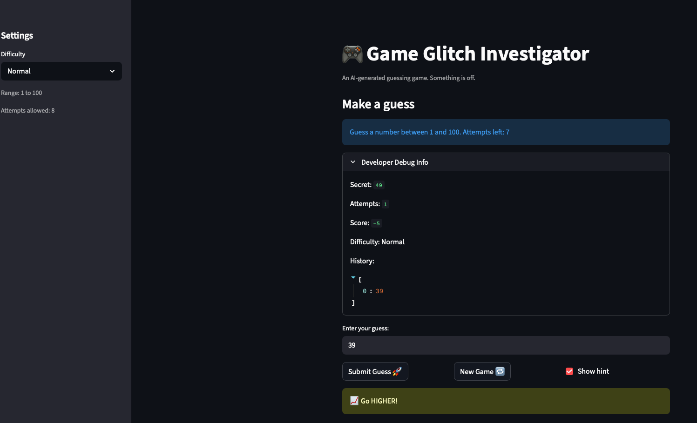

# 🎮 Game Glitch Investigator: The Impossible Guesser

## 🚨 The Situation

You asked an AI to build a simple "Number Guessing Game" using Streamlit.
It wrote the code, ran away, and now the game is unplayable. 

- You can't win.
- The hints lie to you.
- The secret number seems to have commitment issues.

## 🛠️ Setup

1. Install dependencies: `pip install -r requirements.txt`
2. Run the broken app: `python -m streamlit run app.py`

## 🕵️‍♂️ Your Mission

1. **Play the game.** Open the "Developer Debug Info" tab in the app to see the secret number. Try to win.
2. **Find the State Bug.** Why does the secret number change every time you click "Submit"? Ask ChatGPT: *"How do I keep a variable from resetting in Streamlit when I click a button?"*
3. **Fix the Logic.** The hints ("Higher/Lower") are wrong. Fix them.
4. **Refactor & Test.** - Move the logic into `logic_utils.py`.
   - Run `pytest` in your terminal.
   - Keep fixing until all tests pass!

## 📝 Document Your Experience

- [x] **Describe the game's purpose.**  
  The game is a number-guessing challenge where players try to guess a secret number within a range based on difficulty (Easy: 1-20, Normal: 1-100, Hard: 1-50). The app provides hints ("Go HIGHER!" or "Go LOWER!") to guide guesses, tracks attempts, and awards scores based on performance. It's designed to be a simple, interactive game built with Streamlit.

- [x] **Detail which bugs you found.**  
  - Secret number changed on every submit due to missing session state initialization.  
  - "New Game" button caused duplicate element keys and didn't reset input fields properly.  
  - Hints were backwards: "Too High" said "Go HIGHER!" instead of "Go LOWER!", and vice versa.  
  - Secret didn't reset when difficulty changed, keeping old-range values.  
  - No validation for guesses outside the difficulty range, allowing invalid inputs.  
  - Attempts counter had an off-by-one error, showing incorrect "attempts left."  
  - On even attempts, secret was converted to string, causing lexicographical comparisons and wrong hints.  
  - Score logic was inconsistent and didn't reset properly on new games.

- [x] **Explain what fixes you applied.**  
  - Added proper session state initialization for secret, attempts, score, etc., to persist across reruns.  
  - Used dynamic keys for text input to avoid duplicates and enable clearing on "New Game."  
  - Swapped hint messages in `check_guess` and ensured numerical comparisons by converting secret to int.  
  - Added difficulty change detection to regenerate secret in the new range.  
  - Implemented range validation in the submit logic to reject out-of-bounds guesses.  
  - Fixed attempts counter by starting at 0 instead of 1.  
  - Refactored logic into `logic_utils.py` for better organization and added unit tests.  
  - Updated score reset and ensured all state clears on new games.

## 📸 Demo

- [ ] 

## 🚀 Stretch Features

- [ ] [If you choose to complete Challenge 4, insert a screenshot of your Enhanced Game UI here]
